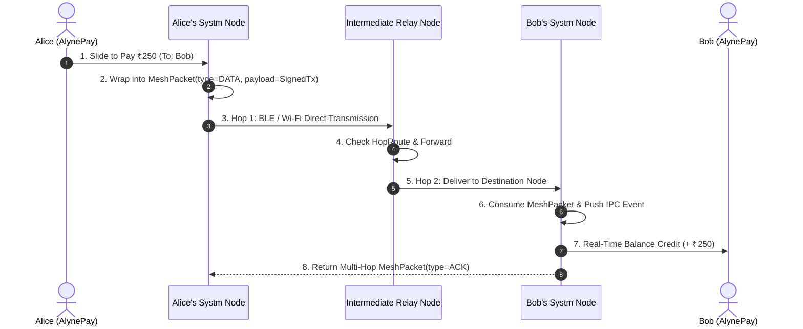

# AlynePay ⚡
### Next-Generation Decentralized Offline Peer-to-Peer Payment Ecosystem

> **AlynePay** is an internet-independent, decentralized payment system that allows users to send and receive digital currency (₹) completely offline. By pairing a modern React Native client with **Systm** — a native Android multi-hop radio mesh engine — AlynePay enables secure transactions across devices using Bluetooth Low Energy (BLE) and local Wi-Fi without cellular data or centralized servers.

---

## 📑 Table of Contents
1. [Overview & Architecture](#-overview--architecture)
2. [Key Features](#-key-features)
3. [System Architecture & Flow](#-system-architecture--flow)
4. [Project Directory Structure](#-project-directory-structure)
5. [How the Decentralized Mesh Works](#-how-the-decentralized-mesh-works)
6. [Getting Started & Installation](#-getting-started--installation)
   - [Running AlynePay (Frontend)](#1-running-alynepay-react-native--expo)
   - [Running Systm (Native Android Daemon)](#2-running-systm-native-android-mesh)
7. [Testing the Payment Flow](#-testing-the-payment-flow)
8. [Design System & Tokens](#-design-system--tokens)

---

## 🌐 Overview & Architecture

AlynePay is composed of two primary engines working seamlessly in tandem:

```
┌──────────────────────────────────────────────────────────┐
│                   AlynePay (Client App)                 │
│      React Native • Expo • TypeScript • Glassmorphic UI  │
│  - Galaxy Balance Vault        - QR Camera Scanner       │
│  - Swipe-to-Pay Slider         - Dynamic Search & Recents│
└────────────────────────────┬─────────────────────────────┘
                             │ Local IPC / REST (127.0.0.1:8765)
┌────────────────────────────┴─────────────────────────────┐
│                    Systm (Mesh Daemon)                   │
│        Native Android (Kotlin) • Foreground Service      │
│  - BLE GATT Proximity Beacons  - Wi-Fi Direct Radio      │
│  - Dijkstra Multi-Hop Routing  - IPvX MeshPacket Protocol│
└──────────────────────────────────────────────────────────┘
```

1. **`alynepay/` (Frontend UI & Wallet Engine)**:
   - Built on React Native and Expo Router with a Dark Onyx aesthetic (`#0F0F0F`), cosmic cyan accents (`#4CD7F6`), and frosted glassmorphism.
   - Manages the local cryptographic wallet state, transaction history, balance deposits, QR scanner, and gesture-driven payment slider.
   - Communicates with the local `Systm` daemon via a non-blocking IPC bridge (`127.0.0.1:8765`).

2. **`Systm/` (Decentralized Mesh Routing Engine)**:
   - Native Android background service (`AlyneNetService`) written in Kotlin.
   - Discovers physical peers in radio proximity via BLE and Wi-Fi Direct.
   - Computes dynamic shortest paths across nodes using **Dijkstra's Algorithm**.
   - Encapsulates payment transactions into multi-hop `MeshPacket(type=DATA)` and handles hop forwarding across intermediary relay devices.

---

## ✨ Key Features

- 📶 **100% Offline & Decentralized**: Transfer funds across physical phones without cell towers, Wi-Fi routers, or internet access.
- 🔀 **Multi-Hop Relay Routing**: If the recipient is outside your direct Bluetooth range, packets automatically hop through intermediary peers to reach the destination.
- 📷 **Integrated QR Viewfinder**: Top-quarter frosted glass division with integrated live camera for rapid QR code scanning.
- 🔍 **Real-Time Nearby Peer Discovery**: Automatically scans and displays nearby physical devices over BLE/Wi-Fi for one-tap payments.
- 🎚️ **Interactive Swipe-to-Pay Slider**: Fluid PanResponder gesture slider that cryptographically signs and dispatches payments.
- 💰 **Vault Top-Up & ₹ (Rupee) Currency**: Full deposit flow with quick increment chips (`+₹100`, `+₹500`, `+₹1000`, `+₹5000`) and live balance updates.
- 📜 **Dynamic Payment Ledger & Recents**: Real-time transaction history with automatic tracking of recently paid peers.
- 🎨 **Premium Glassmorphic Design**: Dark Onyx (`#0F0F0F`), frosted glass masking transitions, JetBrains Mono typography, and glowing cyan/purple indicators.

---

## 🔄 System Architecture & Flow



---

## 📁 Project Directory Structure

```
AlynePay/
├── alynepay/                         # React Native / Expo Frontend Application
│   ├── assets/                       # Brand icons, logo, and splash assets
│   │   ├── images/logo.png           # Minimalist vector mesh brand logo
│   │   └── images/splash-icon.png    # Native splash screen asset
│   ├── src/
│   │   ├── app/                      # Expo Router Stack Pages
│   │   │   ├── _layout.tsx           # Root navigation stack & ThemeProvider
│   │   │   ├── index.tsx             # Home screen (Vault, Scanner, Search, Ledger)
│   │   │   ├── send.tsx              # Payment screen with SwipeSlider
│   │   │   └── deposit.tsx           # Vault deposit & top-up screen
│   │   ├── components/               # UI components (ThemedText, AnimatedSplash)
│   │   ├── constants/theme.ts        # Design tokens (Colors, Typography, Spacing)
│   │   ├── context/wallet-context.tsx# Central reactive wallet state & ledger
│   │   └── services/systm-bridge.ts  # Client IPC bridge to local Systm daemon
│   ├── app.json                      # Expo application configuration
│   └── package.json                  # Dependencies & scripts
│
├── Systm/                            # Native Android Decentralized Mesh Engine
│   ├── app/src/main/
│   │   ├── AndroidManifest.xml       # Foreground service & radio permissions
│   │   └── java/com/alynelabs/systm/
│   │       ├── BleModule.kt          # BLE advertiser, scanner & GATT server
│   │       ├── WifiModule.kt         # Wi-Fi Direct peer-to-peer radio
│   │       ├── mesh/
│   │       │   ├── MeshManager.kt    # Dijkstra routing & packet relay engine
│   │       │   ├── MeshPacket.kt     # IPvX byte serializer / deserializer
│   │       │   ├── NodeIdentity.kt   # Cryptographic 64-bit Node ID manager
│   │       │   └── IPvXAddress.kt    # Multi-bearer addressing protocol
│   │       └── service/
│   │           ├── AlyneNetService.kt # Android Foreground Service
│   │           └── SystmBridgeServer.kt # Embedded 127.0.0.1:8765 HTTP/IPC Server
│   ├── build.gradle.kts              # Gradle project build configuration
│   └── settings.gradle.kts           # Gradle settings
│
└── README.md                         # Project documentation
```

---

## 📡 How the Decentralized Mesh Works

### 1. Multi-Bearer Addressing (`IPvXAddress`)
Each node in the mesh is assigned a unique cryptographic address composed of:
- `Subnet ID` (16-bit)
- `Bearer Class` (BLE = `0x01`, Wi-Fi Direct = `0x02`, IP Sockets = `0x03`)
- `Node Hash ID` (64-bit Long)
- `Port / Sub-interface` (16-bit)

### 2. Dijkstra Shortest-Path Routing
Nodes periodically exchange lightweight **Link State Advertisements (LSA)** containing their local neighbor adjacency table and link metrics (RSSI, Round-Trip Time, Packet Loss Rate). When a payment packet is dispatched:
1. `MeshManager` computes the optimal path using Dijkstra's algorithm.
2. The complete route is packed into the packet header (`hopRoute = [Hop1, Hop2, ..., Target]`).
3. Intermediary nodes read `nextHopIndex`, increment the pointer, and relay the packet to the next adjacent node until it reaches the destination.

### 3. IPC Bridge (`SystmBridgeServer`)
`Systm` exposes a local lightweight HTTP server on `127.0.0.1:8765` so that the React Native app can:
- Query node status (`GET /api/status`)
- Fetch nearby discovered physical peers (`GET /api/peers`)
- Transmit payment packets (`POST /api/pay`)
- Poll or stream incoming payment receipts (`GET /api/events`)

---

## 🚀 Getting Started & Installation

### 1. Running AlynePay (React Native / Expo)

#### Prerequisites
- Node.js (v18+)
- npm or yarn
- Expo Go app on your mobile device (available on [Google Play](https://play.google.com/store/apps/details?id=host.exp.exponent) and [App Store](https://apps.apple.com/app/expo-go/id982107779))

#### Installation & Launch
```bash
# 1. Navigate to the frontend directory
cd alynepay

# 2. Install dependencies
npm install

# 3. Start the development server
npx expo start
```

- **Android**: Open **Expo Go** $\rightarrow$ Scan the terminal QR code.
- **iOS**: Open native **Camera** $\rightarrow$ Scan the terminal QR code.
- **Web**: Press **`w`** in the terminal to preview in your browser (`http://localhost:8081`).

---

### 2. Running Systm (Native Android Mesh)

#### Prerequisites
- Android Studio Ladybug / Iguana or later
- Android SDK 34+
- Physical Android device with Bluetooth & Wi-Fi enabled

#### Build & Install Daemon
```bash
# 1. Navigate to the native engine directory
cd Systm

# 2. Build and install the debug APK onto your connected device
./gradlew installDebug
```

1. Open the **Systm** app and grant Nearby Devices & Bluetooth permissions.
2. The foreground service **AlyneNetService** will start, activating background radio mesh discovery and the local IPC server on port `8765`.

---

## 🧪 Testing the Payment Flow

### In-App UI & Vault Test
1. **Deposit Funds**: Tap **`ADD AMOUNT TO WALLET`**, choose an increment (`+₹500`), and tap **`CONFIRM & ADD FUNDS`**.
2. **Search Peer**: Tap the search bar (**"Search username to pay"**), type any recipient name (e.g. `satoshi` or `alice`), and tap **`SEND`**.
3. **Slide to Pay**: Enter the amount and drag the **`SLIDE TO SEND PAYMENT`** slider knob across to the right. The amount will be deducted, transaction logged in **Payment History**, and the user added to **Recents**.
4. **QR Scanning**: Tap the **`SCAN QR CODE`** square in the header to activate the camera viewfinder and scan peer QR codes.

### Full Hardware Mesh Test (Between 2 Devices)
1. Launch `Systm` on **Device A** and **Device B** (both with BLE enabled).
2. Launch `AlynePay` on both devices.
3. The top badge in `AlynePay` will illuminate **`MESH ACTIVE`** (green dot).
4. Tap **"Search username to pay"** on Device A $\rightarrow$ Device B will appear automatically under **`NEARBY MESH PEERS (BLE / WI-FI)`**.
5. Slide to pay $\rightarrow$ Transaction hops over the radio mesh $\rightarrow$ Device B automatically receives and credits the funds in real time!

---

## 🎨 Design System & Tokens

AlynePay implements a high-contrast dark theme optimized for OLED displays:

| Token Name | Hex Value | Usage |
| :--- | :--- | :--- |
| **Background (Onyx)** | `#0F0F0F` | Main application background |
| **Surface Dark** | `#141313` | Galaxy Card, input cards, modals |
| **Cosmic Cyan** | `#4CD7F6` | Primary accents, QR reticle, active badges |
| **Soft Lavender** | `#D2BBFF` | Secondary accents, slider knob, avatar glow |
| **Success Emerald** | `#34D399` | Transaction credits, mesh online indicators |
| **Error Coral** | `#FFB4AB` | Insufficient balance warning |
| **Outline Glass** | `rgba(255, 255, 255, 0.10)` | Glassmorphic card borders |

---

## 📄 License
This project is licensed under the Apache 2.0 / MIT License.